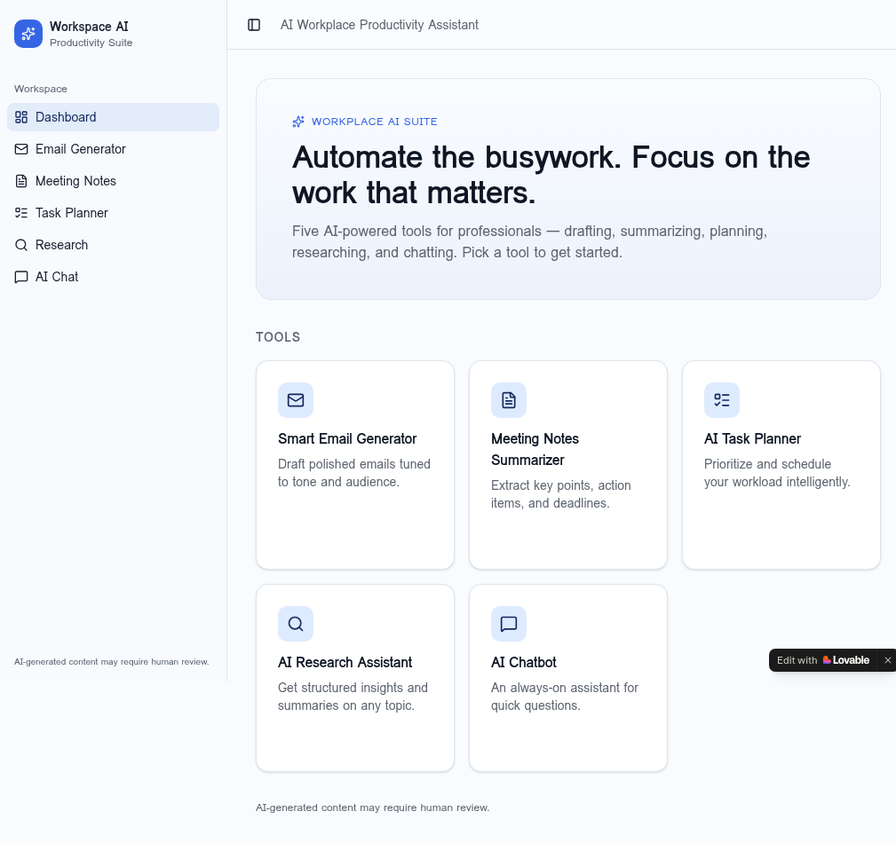
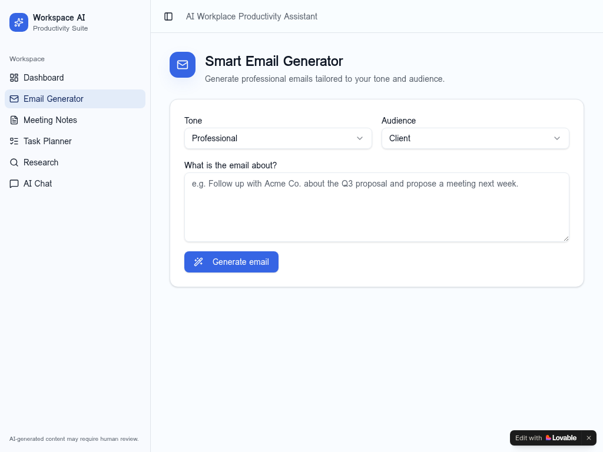
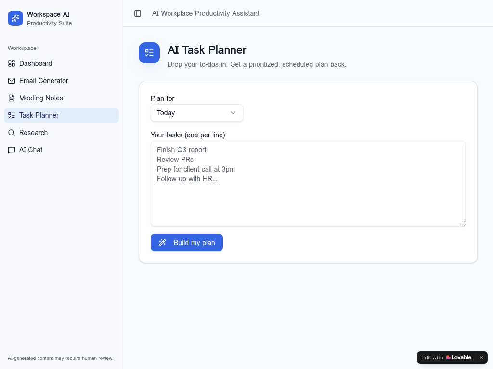
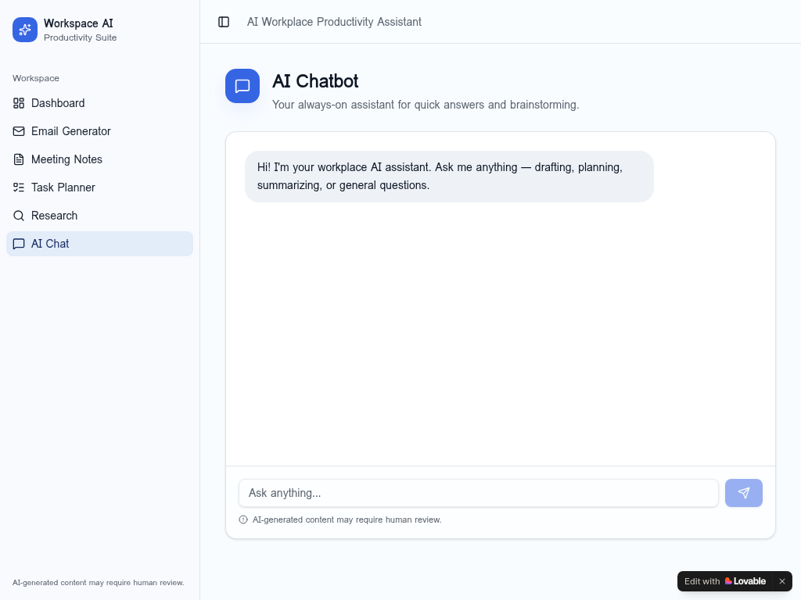

# AI Workplace Productivity Assistant

A modern SaaS-style web app that helps professionals automate everyday work tasks with AI — drafting emails, summarizing meetings, planning tasks, researching topics, and chatting with an always-on assistant.

**Live demo:** https://work-companion-pro.lovable.app

> AI-generated content may require human review.

---

## Demo

### Dashboard
Card-based home with quick access to every tool.



### Smart Email Generator
Tone- and audience-aware email drafting.



### AI Task Planner
Prioritized, scheduled plans from a free-form task list.



### AI Chatbot
An always-on assistant for quick answers and brainstorming.



---

## Features

- **Smart Email Generator** — tone + audience-based, professional drafts
- **Meeting Notes Summarizer** — extract key points, action items, and deadlines
- **AI Task Planner** — Eisenhower-matrix prioritization with a suggested schedule
- **AI Research Assistant** — structured briefings with insights, opportunities, and risks
- **AI Chatbot** — multi-turn conversational assistant
- Structured prompt engineering per feature for clear, professional outputs
- Loading states, responsive design, and a sidebar + card SaaS layout
- Human-review disclaimer surfaced in every output

## Tech Stack

- **TanStack Start** (React 19 + Vite 7) with file-based routing
- **TanStack Server Functions** (`createServerFn`) for AI calls
- **Tailwind CSS v4** with semantic design tokens (`oklch`)
- **shadcn/ui** components
- **Lovable Cloud** (managed Supabase) for backend
- **Lovable AI Gateway** — `google/gemini-3-flash-preview`

## Project Structure

```
src/
  components/             # AppSidebar, AIOutput, FeatureShell, shadcn UI
  lib/ai.functions.ts     # Server functions + per-feature system prompts
  routes/                 # index, email, meetings, tasks, research, chat
  styles.css              # Design tokens, gradients, shadows
```

## Getting Started

```sh
bun install
bun run dev
```

Then open the local preview URL printed in the terminal.

## Deployment

Published via Lovable. Open the project in [Lovable](https://lovable.dev/projects/dfb72dfa-816c-4de3-b0d5-db52a7f97827) and click **Share → Publish**.
